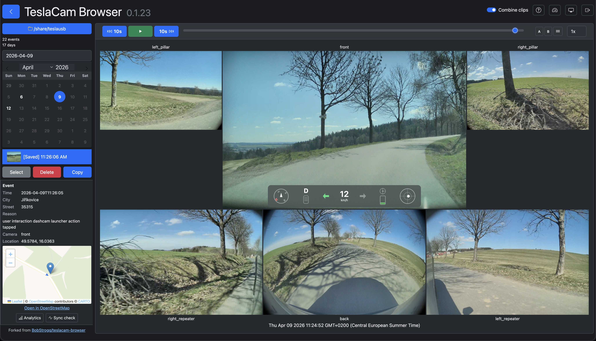

# TeslaCam Browser

Forked from [BobStrogg/teslacam-browser](https://github.com/BobStrogg/teslacam-browser), originally created by Chris Cavanagh.



This is a simple browser for TeslaCam recordings.  These are the files that are generated by Dashcam and [Sentry Mode](https://www.tesla.com/blog/sentry-mode-guarding-your-tesla) on [Tesla](https://www.tesla.com) vehicles.

To use this app, simply click the "Open..." button and browse to the ```TeslaCam``` folder (either by plugging the TeslaCam USB drive into your PC / Mac, or possibly accessing it as a network share over WiFi if supported).  It'll aggregate clips by date and present them on a calendar, and a dropdown list to select individual events on that date.

Basic video playback controls let you view all available cameras side-by-side.  Clicking on a video will open a file browser pointing to the source file.

## Running from the command line

While using the installation packages is the simplest option, you can also run the app from the command line (you'll need to ensure [Electron](https://electronjs.org/docs/tutorial/installation) is installed first).

```
cd teslacam-browser
npm ci
electron .
```

## Running as a headless server

You can run the app as a standalone headless server, even on a Raspberry Pi:

```
cd teslacam-browser
npm ci --omit=dev
node src/server/server.js /path/to/TeslaCam
```

The startup path is required in headless mode and is treated as the fixed root for all file operations.
Folder browsing/switching in the headless web UI is intentionally disabled.

You can then open the app in a browser by pointing to `http://localhost:8088` (replace `localhost` with address of your server).

After updating to a new version, re-run `npm ci --omit=dev` to ensure all dependencies are up to date.

For public exposure, run behind an HTTPS reverse proxy (Nginx, Caddy, Traefik, etc.) and avoid direct internet exposure of the Node process.

### Access logging (headless)

Headless mode writes one JSON access log line per HTTP response to stdout.

Example:

```json
{"ts":"2026-04-09T16:20:31.177Z","method":"GET","path":"/args","status":200,"durationMs":2.431,"ip":"203.0.113.45","forwardedFor":"203.0.113.45, 10.0.0.2","userAgent":"Mozilla/5.0","contentLength":"98"}
```

When running behind a reverse proxy, set `TC_TRUST_IP` to your proxy IP/CIDR ranges so the logged `ip` field reflects the real client address.

## Running with Docker

Pre-built images are published to GitHub Container Registry for `linux/amd64` and `linux/arm64` (including Raspberry Pi 4/5):

```
ghcr.io/mhaluska/teslacam-browser:latest      # most recent master build
ghcr.io/mhaluska/teslacam-browser:0.1.11      # specific release
ghcr.io/mhaluska/teslacam-browser:0.1         # latest patch of a minor line
```

Quick start with `docker run`:

```
docker run -d \
  --name teslacam \
  --restart unless-stopped \
  -p 8088:8088 \
  -v /mnt/teslacam:/data:ro \
  ghcr.io/mhaluska/teslacam-browser:latest
```

The image mounts TeslaCam footage at `/data` and serves the web UI on port `8088`. Mount read-only (`:ro`) to disable deletes at the filesystem level; drop `:ro` if you want the Delete controls in the UI to work.

### docker-compose

A complete example with authentication and reverse-proxy-aware settings is in [docker-compose.yaml](docker-compose.yaml):

```
docker compose up -d
```

Edit the file to set `TC_AUTH_USER` / `TC_AUTH_PASS_HASH` / `TC_AUTH_SECRET` before starting. All authentication and tuning env vars from the [Authentication](#authentication) section below are supported — pass them as `environment:` entries.

When setting `TC_AUTH_PASS_HASH` in a compose file, escape each `$` as `$$` so Compose does not try to interpolate it (e.g. `scrypt$$N$$r$$p$$salt$$dk`).

## Authentication

When running as a headless server on a network, authentication should be enabled.

To enable authentication, set `TC_AUTH_USER` and `TC_AUTH_PASS_HASH`:

```
TC_AUTH_USER=admin TC_AUTH_PASS_HASH=<hash> node src/server/server.js /path/to/TeslaCam
```

`TC_AUTH_PASS_HASH` keeps the same variable name, but now supports a password-hard `scrypt` format:

```
scrypt$N$r$p$saltBase64$dkBase64
```

Generate an `scrypt` hash (recommended):

```
npm run hash-password
```

You will be prompted to enter and confirm your password (input is masked with `*`). The command prints a value you can paste into `TC_AUTH_PASS_HASH`.


Additional optional variables:

| Variable | Default | Description |
|---|---|---|
| `TC_AUTH_SECRET` | Random per startup | Secret key for signing session cookies. If not set, sessions are invalidated on server restart. |
| `TC_SESSION_DAYS` | `7` | Session lifetime in days. |
| `TC_COOKIE_SECURE` | `auto` | Session cookie secure mode (`auto`, `true`, `false`). Use `auto` behind HTTPS reverse proxy. |
| `TC_TRUST_IP` | _(unset)_ | Comma-separated trusted proxy IP/CIDR list used for Express `trust proxy` (example: `127.0.0.1,10.0.0.0/8,192.168.1.0/24`). |
| `TC_ENABLE_HELMET` | `true` | Enables HTTP security headers middleware. |
| `TC_CSP_UPGRADE_INSECURE_REQUESTS` | `false` | Adds CSP `upgrade-insecure-requests` when `true`. Keep `false` for direct HTTP LAN access; set `true` when serving only behind HTTPS. |
| `TC_LOGIN_MAX_ATTEMPTS` | `10` | Max login attempts per 10-minute window per IP. |
| `TC_DELETE_MAX_PER_MINUTE` | `20` | Max destructive requests (`deleteFiles`, `deleteFolder`) per minute per IP. |
| `TC_API_MAX_PER_MINUTE` | `600` | Max read/telemetry API requests per minute per IP (covers `/files`, `/eventJson`, `/clipTelemetry`, `/copyPath`, `/copyFilePaths`, `/reopenFolders`, `/openDefaultFolder`). |
| `TC_CSRF_SECRET` | Random per startup | Secret used to mint CSRF tokens for authenticated POST requests. |
| `TC_HIDE_DELETE_BUTTONS` | `true` | When `true`, hides clip/folder Delete controls in the headless web UI and rejects delete API calls (`403`). Set to `false` to allow deletes. |

Authentication only applies to the web server mode. The Electron desktop app is not affected.

### Public deployment checklist (headless)

<p style="color:#b00020;"><strong>Warning:</strong> Do not expose this application to the public Internet. Use it on a trusted LAN, behind a VPN, or with strict private access only—hardening does not make wide internet exposure a good idea.</p>

1. Set `TC_AUTH_USER`, `TC_AUTH_PASS_HASH`, and a persistent `TC_AUTH_SECRET`.
2. Place the app behind HTTPS reverse proxy and do not expose raw Node port directly.
3. Set `TC_TRUST_IP` to your reverse proxy IP/CIDR ranges.
4. Keep `TC_COOKIE_SECURE=auto` (or `true` if TLS is always used end-to-end).
5. If all browser traffic is HTTPS, optionally set `TC_CSP_UPGRADE_INSECURE_REQUESTS=true`.
6. Review rate-limit env vars for your traffic profile.

## Project layout

```
src/
  main/       Electron main process (main.js, menu.js, preload.js)
  server/     Shared backend used by both Electron and headless modes
              (server.js, services.js, auth.js, logger.js, seiTelemetry.js, dashcam.proto)
  renderer/   Browser assets: HTML, CSS, Vue UI scripts, favicon
scripts/      Developer utilities (hash-password.js)
images/       App icon and README assets
```

Electron loads `src/renderer/index.html`; headless mode serves `src/renderer/external.html` over HTTP on port 8088.

## License

[CC0 1.0 (Public Domain)](LICENSE.md)
